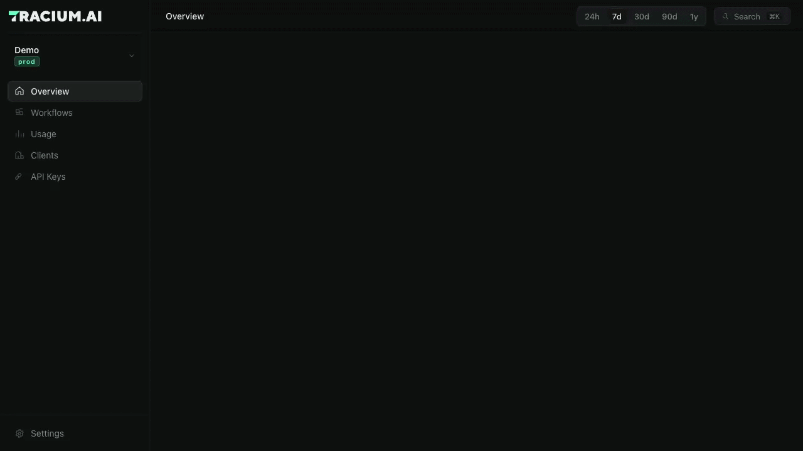

# Tracium

**Open-source, self-hosted LLM observability.** Tracium is an OpenTelemetry-native
backend for LLM apps: point any OTel-instrumented app at it and get accurate cost, token,
latency, and error analytics per model, workflow, and end-client, built to stay
fast from the first span to hundreds of millions.



It doesn't wrap the OTel SDK, it *is* an OTel backend: any app already exporting
OTLP can send to Tracium with no code changes.

- **License:** Apache 2.0.
- **Self-hosted:** runs on your infrastructure; one `docker compose up` brings up
  the whole stack, and your prompts and traces never leave it.

## Quickstart

Requires Docker with Compose v2.

```bash
git clone https://github.com/antonij-tracium/tracium
cd tracium
cp .env.example .env
# Fill in JWT_SECRET, CLICKHOUSE_PASSWORD, and POSTGRES_PASSWORD in .env.
# Generate a separate value for each with: openssl rand -hex 32
docker compose up
```

This pulls the release images (amd64 and arm64) pinned by `TRACIUM_VERSION` in
`.env`. To build from your checkout instead, run
`docker compose -f docker-compose.yml -f compose.build.yaml up --build` (or `make up`).
Schema migrations run automatically before the app services start.

| Service | URL / port | Purpose |
|---|---|---|
| Dashboard | http://localhost:3000 | Trace viewer + overview UI |
| API | http://localhost:8090 | REST API (`/v1/...`) the dashboard reads |
| Collector (OTLP gRPC) | `localhost:4317` | Point your app's OTLP exporter here |
| Collector (OTLP HTTP) | `localhost:4318` | Same, HTTP/protobuf |
| Collector (health) | http://localhost:13133/ | Liveness / readiness |

Open the dashboard, create an account, and create your first workspace. Open the
workspace's **API keys** screen, create a key, and copy the `trc_…` token; it is
shown only once. In your instrumented app, set:

```bash
OTEL_EXPORTER_OTLP_ENDPOINT=http://localhost:4318
OTEL_EXPORTER_OTLP_PROTOCOL=http/protobuf
OTEL_EXPORTER_OTLP_HEADERS="Authorization=Bearer YOUR_API_KEY"
```

The key both authenticates the sender and decides which workspace the telemetry
lands in, so you do not set a workspace attribute. Ingest is key-only: a request
with no key, or an unknown or revoked one, is rejected with 401 and nothing is
stored.

### Works with

Tracium reads the [OpenTelemetry GenAI semantic conventions](https://opentelemetry.io/docs/specs/semconv/gen-ai/)
(`gen_ai.request.model`, `gen_ai.usage.input_tokens`, …) and the attributes
[OpenLLMetry](https://github.com/traceloop/openllmetry) emits, so these work
without code changes beyond the exporter settings above:

- **OpenLLMetry** (Python and JS/TS): auto-instruments OpenAI, Anthropic,
  Bedrock, Vertex AI, LangChain, LlamaIndex and more, and its
  `workflow`/`task`/`agent`/`tool` decorators become Tracium workflows.
- **OpenTelemetry GenAI instrumentations**, such as
  `opentelemetry-instrumentation-openai-v2`.
- **Your own spans**: set the `gen_ai.*` attributes on any OTel span.

Runnable senders are in [`examples/`](examples/); each needs `TRACIUM_API_KEY`:

| Example | What it sends |
|---|---|
| [`node/genai-span.mjs`](examples/node/genai-span.mjs) | A two-call workflow with hand-set GenAI attributes; no LLM key needed |
| [`openai_to_tracium.py`](examples/openai_to_tracium.py) | A multi-step OpenAI agent with tool calls, via OpenLLMetry |
| [`failed_span_to_tracium.py`](examples/failed_span_to_tracium.py) | A batch job whose last OpenAI call fails |

```bash
cd examples/node && npm install
TRACIUM_API_KEY=trc_... npm start
```

Compose binds published ports to loopback. The dashboard uses its own origin for
API requests, so it also works through a reverse proxy without rebuilding the
frontend.

**Want data to look at right away?** With the stack up, seed a demo account,
workspaces, and ~1,400 realistic traces in one command (requires Node.js 18+):

```bash
cd dashboard && npm run seed
```

Then sign in at http://localhost:3000 with `demo@tracium.ai` / `tracium-demo-1234`.
See [dashboard/README.md](dashboard/README.md#seed-demo-data) for options.

> OTLP ingest **requires a per-workspace API key** on every request; there is no
> anonymous path. Keeping the ports on a trusted network is still sound defense in
> depth. See [securing the collector](deploy/docs/collector-auth.md).

## Architecture

```
your app ──OTLP──▶ collector ──▶ ClickHouse ◀── api ◀──REST── dashboard
(gRPC/HTTP)      (enrich: cost,    (spans +      (bounded          (trace viewer)
                  user, model)      rollups)      reads)
                                   Postgres ◀── api (users, auth, config)
```

The collector is a generic OpenTelemetry Collector distribution plus two Tracium
components; all domain logic sits behind an `enrich.Enricher` seam. **Storage split:** ClickHouse
holds span/trace data (time-partitioned, daily rollup so query cost tracks the
window, not total rows); Postgres holds config and accounts.

| Directory | Language | Responsibility |
|---|---|---|
| [`collector/`](collector/) | Go | Receive OTLP, enrich, write to ClickHouse (see [ARCHITECTURE.md](collector/ARCHITECTURE.md)) |
| [`api/`](api/) | Go | Serve trace/metric data to the dashboard (REST) |
| [`dashboard/`](dashboard/) | React + TS | Trace viewer UI |
| [`spec/`](spec/) | JSON/YAML | Source of truth for API contracts + schemas |
| [`deploy/`](deploy/) | YAML/Helm | Helm chart, migration runner, infra config |

Each directory has its own `README.md` with the details.

## Configuration

- **`JWT_SECRET` is required.** It signs and verifies auth tokens with one key, so
  generate a unique one per deployment (`openssl rand -hex 32`).
- **Retention:** `RETENTION_DAYS` (default 90; `0` keeps data forever).
- **Cost allocation:** any custom OTLP attribute your apps attach (e.g. `team`,
  `user.id`, `environment`) is retained and becomes a dimension you can allocate
  spend by with `GET /v1/metrics/usage-by-attribute?key=team`, or the dashboard's
  cost-allocation picker.
- **Clients:** tag spans with `tracium.user.id` (span or resource attribute) to
  meter spend per end client. The dashboard's **Clients** page lists them, and
  each client's detail page breaks down its spend, runs, failure rate, latency,
  models, workflows and recent traces. It's a metering label, not an access
  boundary.
- **Prompt/completion capture is ON by default** (`capture_content: true`) so the
  viewer can show inputs/outputs; set it off if you don't want that text stored.

## Kubernetes

Helm chart in [`deploy/helm/tracium`](deploy/helm/tracium/); steps in
[`deploy/README.md`](deploy/README.md).

## Scope and upgrades

Live traces, overview metrics, per-client usage, workspace creation, and
workspace access checks are available. Ingest requires a per-workspace API key
on every request. Issue keys from the dashboard's API-keys screen or via
`POST /v1/workspaces/{id}/api-keys`; the collector's `traciumauth` authenticator
verifies each one and rejects anything unknown or revoked
([securing the collector](deploy/docs/collector-auth.md)). A key is bound to one
workspace and is the source of truth for where its telemetry lands: the collector
stamps the key's workspace onto every span, so senders don't set a workspace
attribute at all.

Workspace owners invite teammates by email from **Settings → Members** (or
`POST /v1/workspaces/{id}/invites`). Tracium doesn't send email: the owner gets a
single-use link (`/invite/<token>`, valid for 7 days) to share, and the invitee
accepts it after signing in or signing up with the invited address. Owners can
list and revoke open invites and remove members from the same screen.

Signed-in users change their password under **Settings → Account** (or
`POST /v1/auth/password`); there is no email-based reset, so an operator resets
a forgotten password with the API image's CLI:

```bash
docker compose exec api ./reset-password --email you@example.com
```

It prints a generated password unless you pass `--password`. Profile editing,
workspace editing, and retention controls in the UI are unavailable; the UI
labels these limitations. Configure retention in the deployment.

Existing installations must follow [the upgrade guide](deploy/docs/upgrading.md)
before adopting workspace scoping. The migration preserves legacy aggregates and
requires an explicit destination workspace rather than guessing data ownership.

## Contributing

See [CONTRIBUTING.md](CONTRIBUTING.md). Security reports: [SECURITY.md](SECURITY.md).

## License

Apache 2.0. See [LICENSE](LICENSE).
